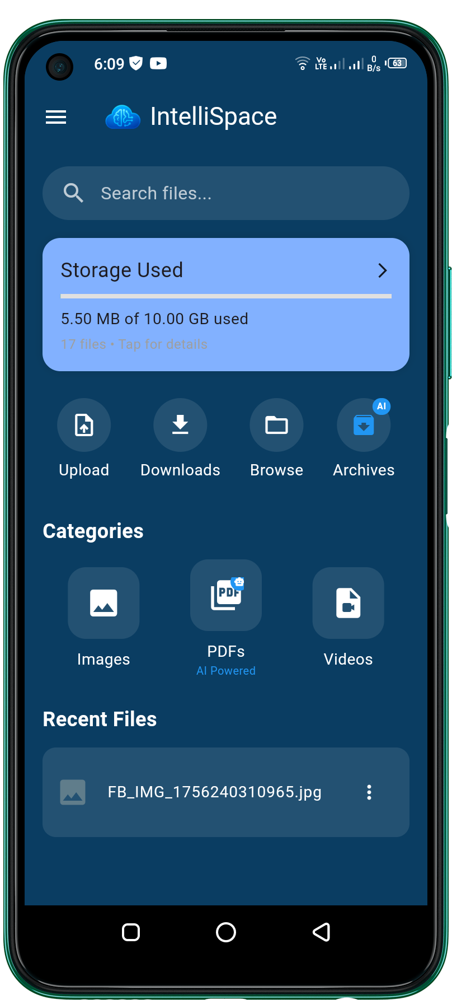
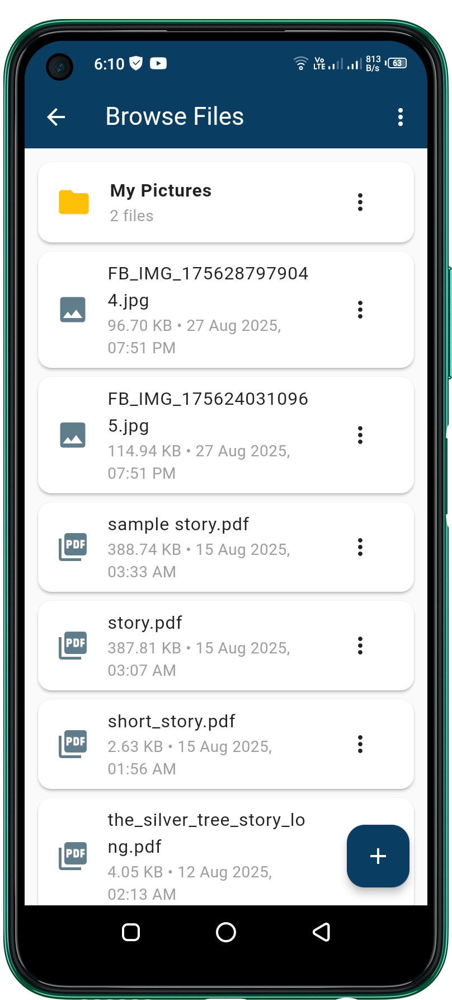
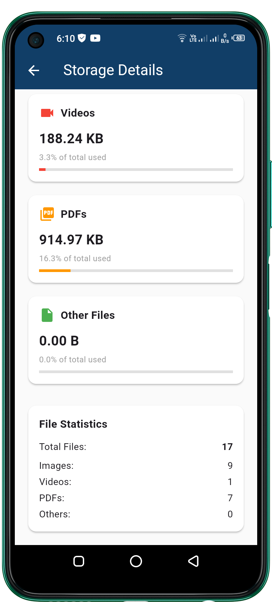
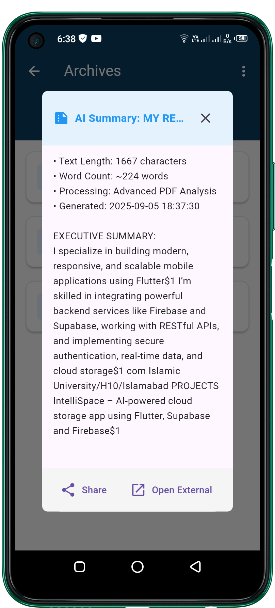
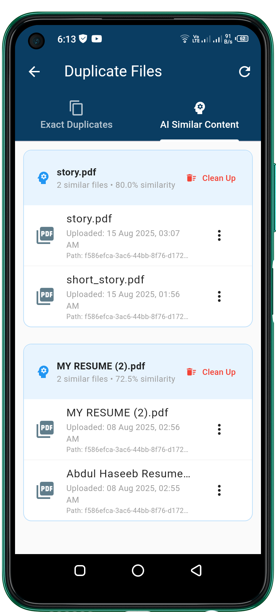
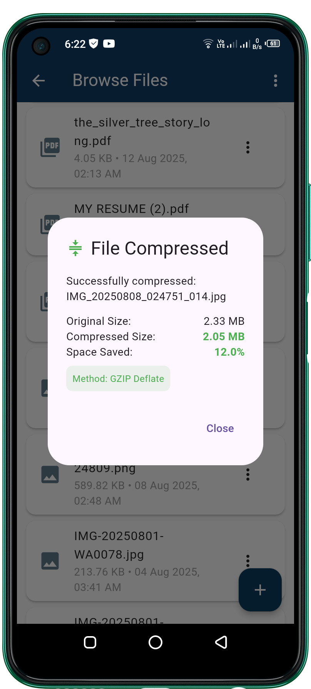
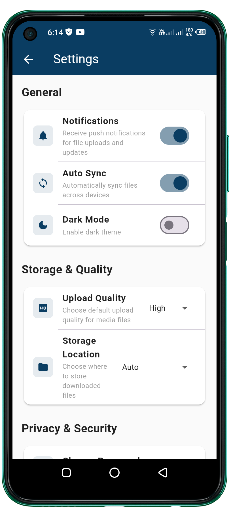

# 🌌 IntelliSpace


> **IntelliSpace** is an **AI-powered cloud storage application** built with Flutter and Supabase.  
It provides secure file storage, intelligent file organization, and modern tools like summarization, duplicate detection, and compression — all in a cross-platform experience.

---

## ✨ Features

- 🔐 **Secure Storage** – Private Supabase bucket with Row-Level Security
- 📂 **Smart Organization** – Automatically groups files by type (images, videos, documents, etc.)
- 🤝 **File Sharing** – Generate secure, time-limited share links
- 🧠 **AI Tools** –
    - Content summarization of text/PDFs
    - Duplicate file detection
    - Intelligent file search
- 📉 **Compression** – Reduce file size without losing quality
- 📱 **Cross-Platform** – Works on Android, iOS, Web, and Desktop

---

## 📸 Screenshots

### 🏠 Dashboard


---

### 📂 File Management
| Browse Files | Storage Details |
|--------------|-----------------|
|  |  |

---

### 🧠 AI Tools
| Summarization | Duplicate Detection |
|---------------|----------------------|
|  |  |

---

### ⚙️ Utilities
| File Compression | App Settings |
|------------------|--------------|
|  |  |

---

## 🛠 Tech Stack

- [Flutter](https://flutter.dev/) – Cross-platform frontend
- [Supabase](https://supabase.com/) – Auth, Database, Storage
- [Node.js](https://nodejs.org/) – Optional APIs for advanced AI processing
- [AI APIs](https://aistudio.google.com/app/apikey)- Pdf Summarization
---

## 🚀 Getting Started

### 1️⃣ Clone the Repository
```bash
git clone https://github.com/haseeb-dev-cloud/intellispace.git
cd intellispace
2️⃣ Install Dependencies
flutter pub get

3️⃣ Configure Environment

Create a .env file in the project root with your Supabase credentials:

SUPABASE_URL=your-supabase-url
SUPABASE_ANON_KEY=your-supabase-anon-key


(⚠️ Never commit your real keys to GitHub — add .env to .gitignore)

4️⃣ Run the App
flutter run

🧑‍💻 Contributing

Contributions are welcome! 🎉

Fork the repository

Create a new branch (feature/your-feature)

Commit your changes

Push to your fork

Open a Pull Request

See CONTRIBUTING.md
 for more details.

📅 Roadmap

 Add offline sync for files

 Support for .zip, .pptx, .mp3, .docx, and more file types

 Advanced AI-based semantic search

 Real-time collaboration on documents

 IntelliSpace v1.0 release 🚀

🧪 Testing

Run unit and widget tests with:

flutter test

📜 License

This project is licensed under the MIT License – see LICENSE
 for details.

💡 Acknowledgements

Supabase

Flutter

Hugging Face

Gemini

Open source community 🚀

⭐ If you find IntelliSpace useful, don’t forget to star the repo!
